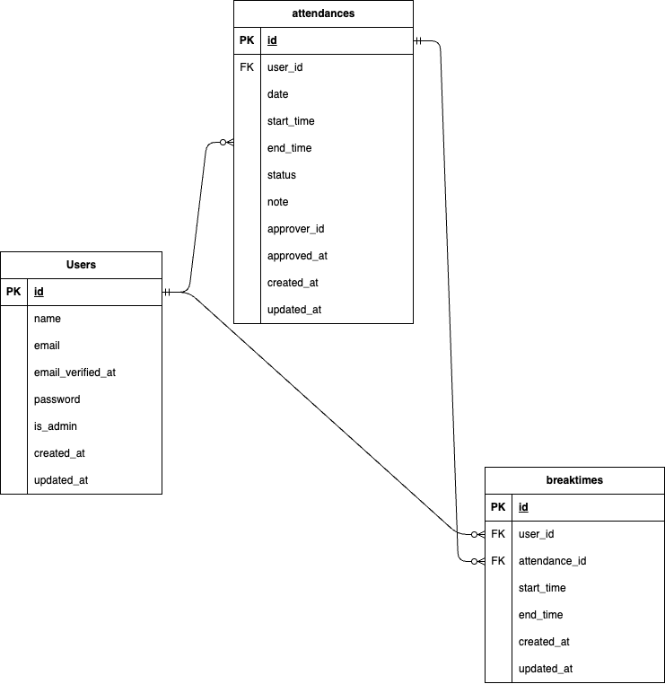

# coachtech 勤怠管理アプリ

## 環境構築

### Dockerビルド
1. 必要ディレクトリの作成
2. DockerDesktopアプリを立ち上げる
3. `docker-compose up -d --build`

### Laravel環境構築
1. `docker-compose exec php bash`
2. `composer install`
3. .envファイルを作成
    - `.env.example`をコピーして`.env`ファイルを作成
4. .envファイルに以下の環境変数を追加
- DB設定
```ini
        DB_CONNECTION=mysql
        DB_HOST=mysql
        DB_PORT=3306
        DB_DATABASE=laravel_db
        DB_USERNAME=laravel_user
        DB_PASSWORD=laravel_pass
```
- メール設定 (MailHog)
    ローカル環境でメールをテストするためにMailHogを使用します。
```ini
        MAIL_MAILER=smtp
        MAIL_HOST=mailhog
        MAIL_PORT=1025
        MAIL_USERNAME=null
        MAIL_PASSWORD=null
        MAIL_ENCRYPTION=null
        MAIL_FROM_ADDRESS="no-reply@example.com"
        MAIL_FROM_NAME="${APP_NAME}"
```

5. アプリケーションキーの作成
　　`php artisan key:generate`

6. データベースのセットアップ
    - マイグレーションの実行
        `php artisan migrate`
    - シードの実行
        `php artisan db:seed`

7. MailHogの起動
　　`docker-compose up -d mailhog`

8. 画面での操作
ブラウザで `http://localhost` にアクセスしてください

## テスト

### テストの実行
Dockerコンテナ内でテストを実行します。

1. PHPコンテナに入る
```bash
    docker-compose exec php bash
```

2. テストの実行
    - 全テストを実行
```bash
        php artisan test
```
    - 特定のテストファイルを実行
```bash
        php artisan test tests/Feature/ExampleTest.php
```
※実行後はDBのマイグレーションとシードを再実行してください

## 使用技術（実行環境）

- **フレームワーク**: Laravel [8.6.12]
- **バックエンド**: PHP [8.3.23]
- **フロントエンド**: HTML, CSS, JavaScript
- **データベース**: MySQL [8.0.26]
- **認証**: Laravel Fortify , MailHog
- **テスト**: PHPUnit

## ER図


## URL
- 開発環境：http://localhost/
- phpMyAdmin：http://localhost:8080/
- MailHog: http://localhost:8025/

## 使い方
- **ユーザー登録**: `/register` で新しいアカウントを作成できます。
- **ログイン**: `/login` でログインできます。
- **管理者ログイン**: `/admin/login` 
- **デモアカウント**: 以下の情報でログインして機能を試すことができます。
  - 一般ユーザー
    - **メールアドレス**: `user@example.com`
    - **パスワード**: `user1234`
  - 管理者ユーザー
    - **メールアドレス**: `admin@example.com`
    - **パスワード**: `admin123`